# Lab2

Vladyslav Yakovlev 
IA2404
Applied informatics

Уровень: Продвинутый

Приложение: open_capsules_php_oop

Github: https://github.com/my-php-deploying-labs-organization/app_lab2

## 1 Подготовка аккаунта


```
Что разрешает политика AdministratorAccess? Почему для повседневной работы нельзя использовать root?
```
Полный доступ ко всем ресурсам, за исключением всего что касается управления аккаунтом root.

## 2 Запуск экземпляра EC2

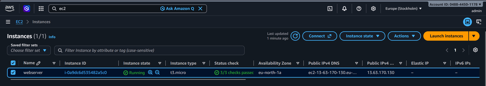
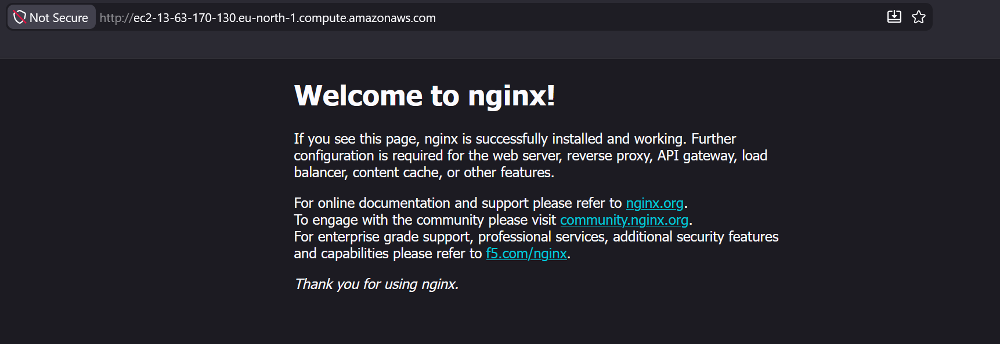

```
Что такое User data и когда выполняется этот скрипт? Выполнится ли он повторно после перезагрузки экземпляра?
```
User data — это скрипт или набор команд, которые передаются EC2-экземпляру для автоматической начальной настройки. В данном случае скрипт выполняется при первом запуске экземпляра через cloud-init, обновляет систему, устанавливает htop и nginx и запускает nginx. По умолчанию после обычной перезагрузки экземпляра User data повторно не выполняется.

## 3 Мониторинг и диагностика

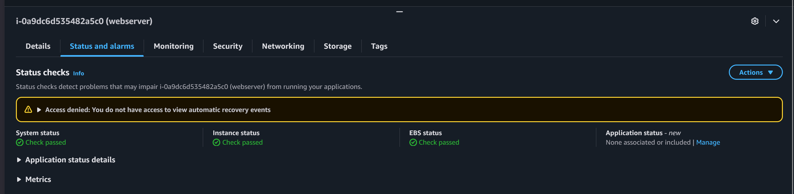
Instance status check обычно показывает проблему внутри EC2-экземпляра, которую может исправить пользователь. System status check показывает проблему инфраструктуры AWS. Attached EBS status check связан с доступностью подключённых EBS-томов и чаще указывает на проблему хранения на стороне AWS.

```
В каких случаях стоит включать детальный мониторинг?
```
Detailed monitoring стоит включать для критичных или нагруженных приложений, когда необходимо получать метрики с большей частотой и быстрее реагировать на проблемы или изменение нагрузки. Он предоставляет метрики с интервалом 1 минута вместо 5 минут при базовом мониторинге, но требует дополнительной оплаты.

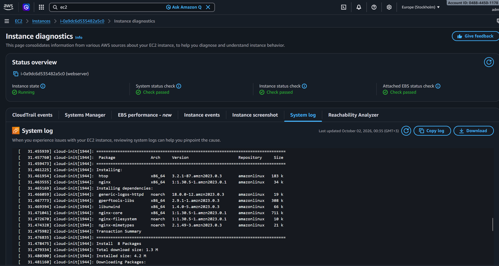
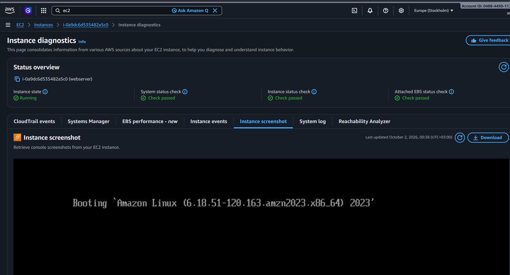

## 4 Подключение по SSH

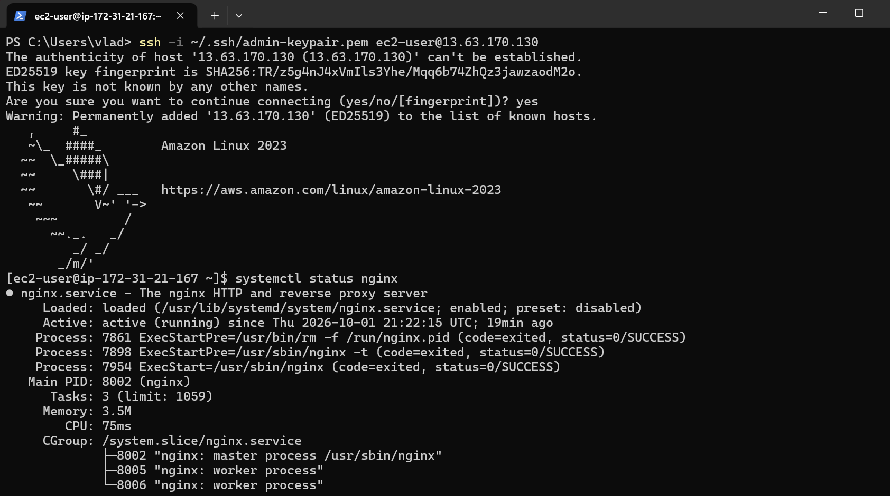
```
Почему для входа на экземпляр EC2 используется ключ, а не пароль?
```
Потому что это безопаснее и удобнее (для кого то другого).
Пароль можно подобрать brute-force атакой, переиспользовать или случайно сделать слабым. SSH-ключ очень длинный криптографический секрет, поэтому подобрать его практически нереально. Кроме того, приватный ключ не передаётся серверу во время входа.

## 5 Статический сайт

```
Что делает команда scp и чем она похожа на ssh?
```
команда для безопасного копирования файлов между компьютерами по сети. Она похожа на ssh, потому что scp использует SSH-соединение для передачи данных. Поэтому у них похожая авторизация.

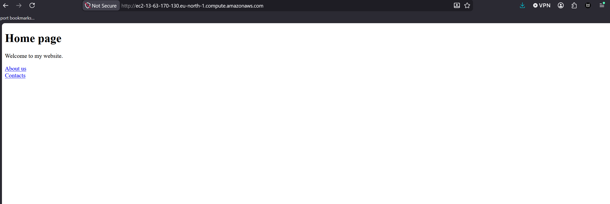

## 6 Остановка экземпляра через AWS CLI

```
aws ec2 stop-instances --instance-ids <ID-экземпляра> --region eu-central-1
```

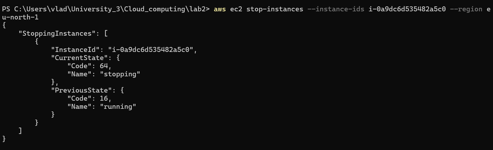
```
Чем Stop отличается от Terminate? За что вы продолжаете платить, пока экземпляр остановлен?
```

# Продвинутый уровень

## 7 Организация и репозиторий на GitHub

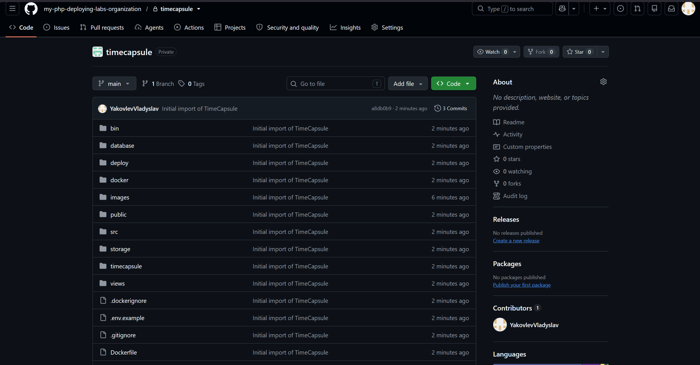

## 8 Подготовка сервера

```
Почему мы устанавливаем эти пакеты вручную, а не добавляем их в User data?
```
В данном случае мы устанавливаем пакеты вручную, потому что User data предназначен в основном для первоначальной настройки экземпляра при создании, а не для постоянного управления состоянием сервера.

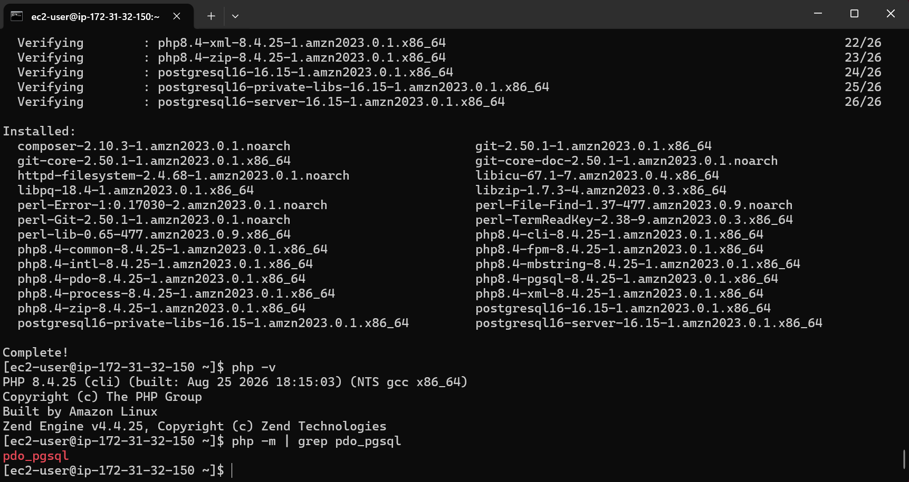

## 9 База данных PostgreSQL

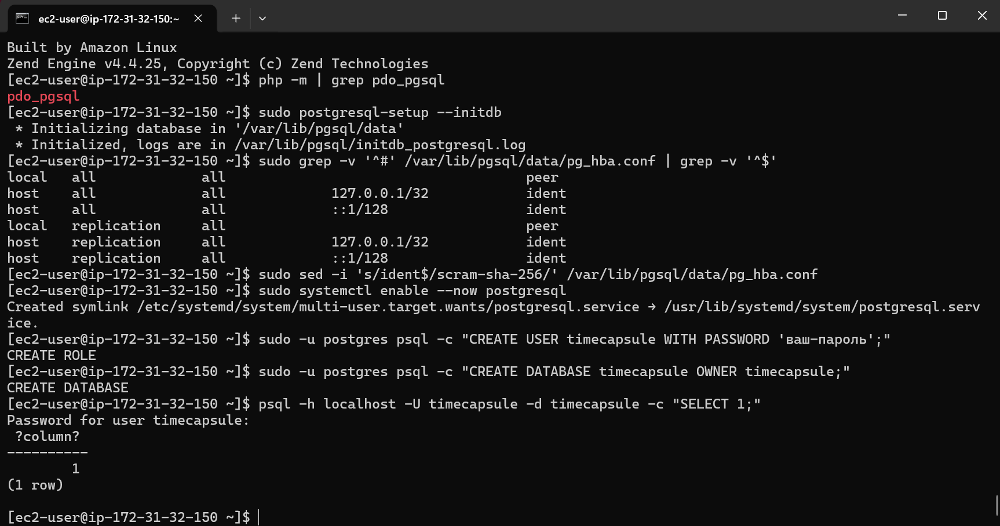

## 10. Развёртывание кода приложения на сервере

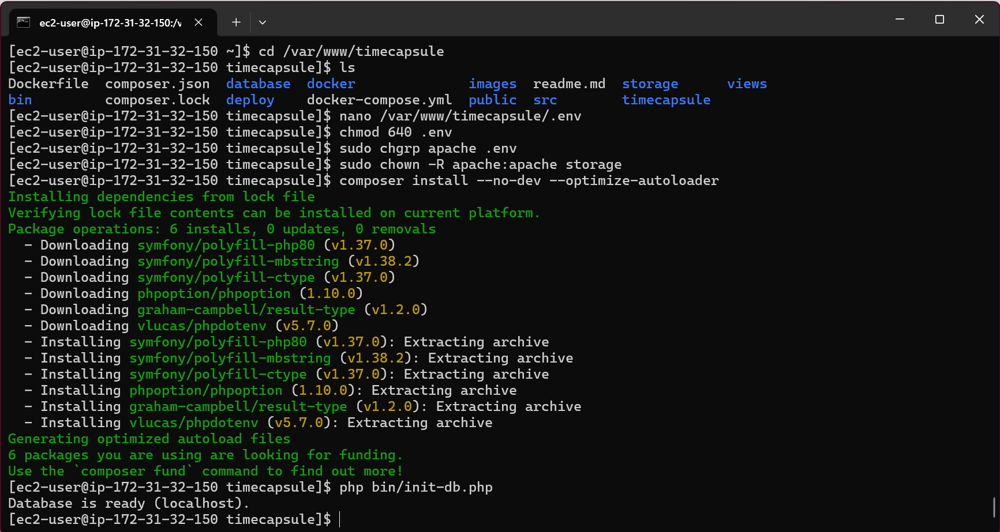

```
Почему пароль к базе данных хранится в файле .env на сервере, а не в коде в репозитории? Почему публичный репозиторий безопасен для этого приложения?
```
Ради безопасности. Все секреты хранятся в окружении ос, и у посторонних нет способа их посмотреть кроме как узнать как подключиться ко всей машине.

## 11. Настройка PHP-FPM и nginx

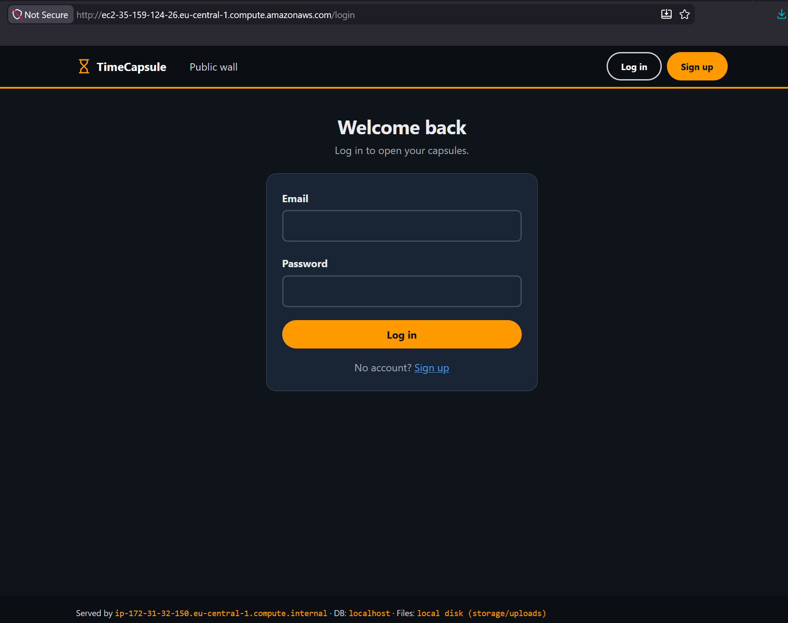
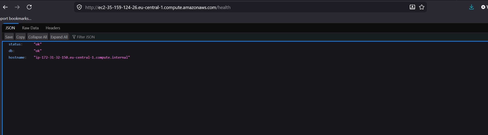

## 12. Обновление приложения

Вариант A. Вручную

Подключиться к серверу по SSH и выполнить:
```
cd /var/www/timecapsule
git pull
composer install --no-dev --optimize-autoloader
php bin/init-db.php
sudo systemctl reload php-fpm
```

```
git pull заменяет файлы по одному, и это занимает несколько секунд. Что может увидеть посетитель, который откроет сайт в этот момент? Что случится с сайтом, если после git pull не выполнится composer install?
```
Во время выполнения git pull файлы обновляются не атомарно, поэтому посетитель может получить промежуточное состояние приложения: ошибки PHP, некорректное отображение страницы или несовместимость между новыми и старыми файлами. После обновления кода необходимо выполнять composer install, так как он устанавливает зависимости приложения из composer.lock. Если этого не сделать, приложение может использовать отсутствующие или несовместимые библиотеки и завершаться с ошибками.

## 13. Новая версия, поломка и откат

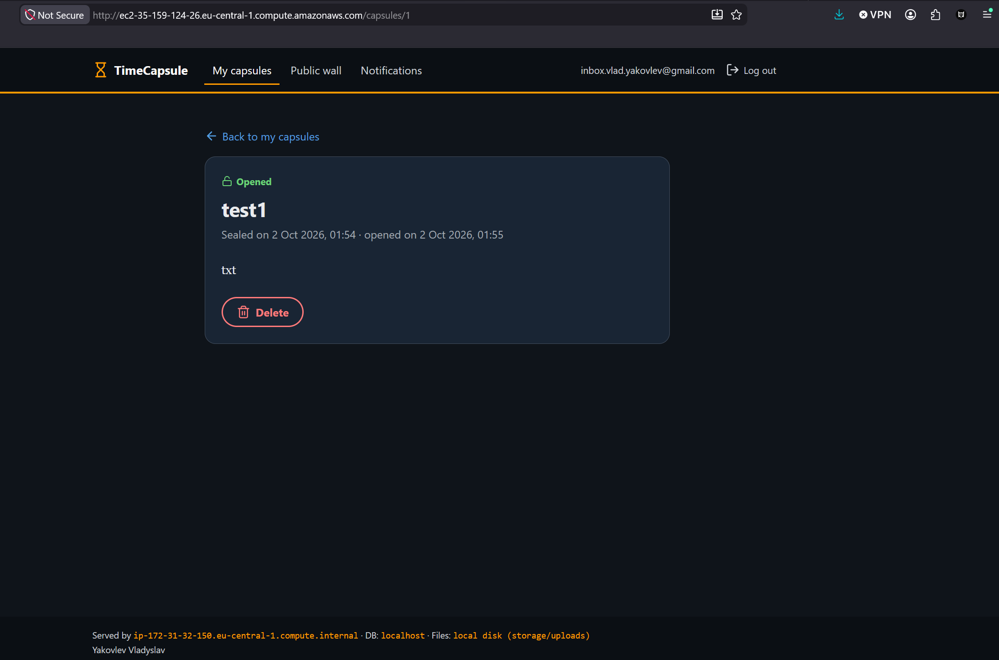

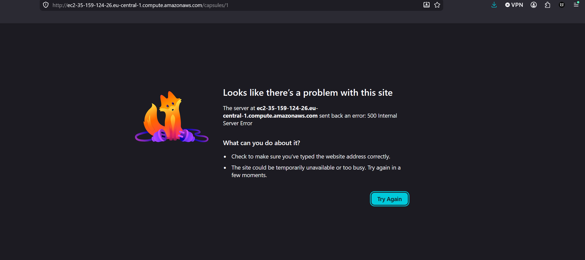

```
Почему /health отвечает ok, хотя главная страница не работает? Что на самом деле проверяет этот адрес? Чего не хватает такой проверке?
```

Потому что этот эндпоинт возвращает рузельтат проверки самого инстанса, и дб. Поломка произошла на PHP сервере.

```
Сколько времени сайт был сломан? Из каких шагов сложилось это время? Как можно было бы сократить его?
```
Сайт лежал пока последний коммит не был отменен, и сервер не стянул изменения. Сократить это время до нуля можно при помощи CI/CD, который проверяет билд и запускает тесты перед каждым изменением кода приложения. Такой коммит, ломающий страницу, не прошел бы.

## 14. Архитектура и решение

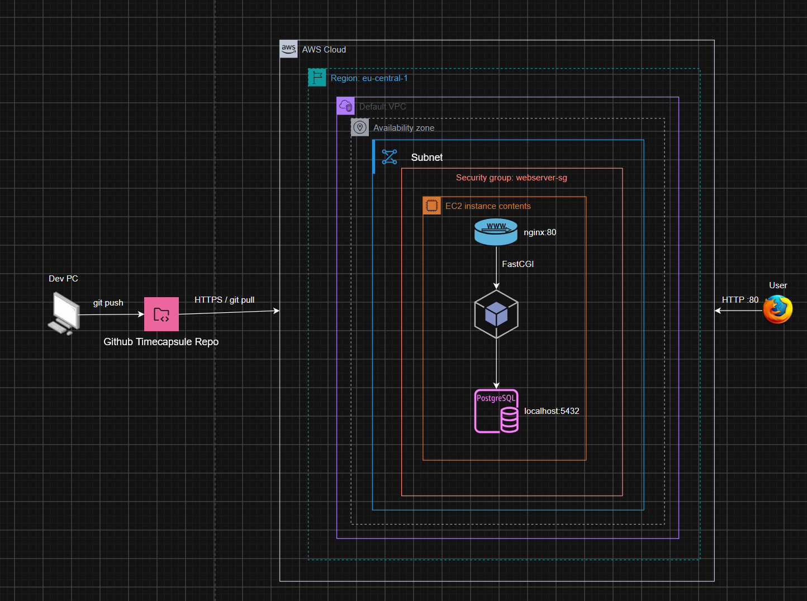

# ADR-0001. Способ развёртывания приложения TimeCapsule

**Статус:** принято  
**Дата:** 2026-10-02

## Контекст

Приложение TimeCapsule развёрнуто на одном экземпляре Amazon EC2. Исходный код хранится в публичном репозитории GitHub.

При выпуске новой версии необходимо получить актуальный код из репозитория, установить зависимости приложения, обновить структуру базы данных при необходимости и перезагрузить PHP-FPM.

Для учебного проекта требуется простой и понятный способ развёртывания, который можно выполнять вручную и контролировать на каждом этапе.

## Решение

Для развёртывания приложения используется ручной способ через SSH.

Разработчик подключается к серверу и выполняет следующие команды:

```bash
cd /var/www/timecapsule
git pull
composer install --no-dev --optimize-autoloader
php bin/init-db.php
sudo systemctl reload php-fpm
```

`git pull` получает новую версию приложения из GitHub.  
`composer install` устанавливает версии библиотек, указанные в `composer.lock`.  
`php bin/init-db.php` создаёт недостающие таблицы в базе данных.  
Перезагрузка PHP-FPM позволяет приложению использовать обновлённый код.

## Рассмотренные альтернативы

### Копирование файлов через `scp`

При таком подходе файлы копируются напрямую с компьютера разработчика на сервер.

Преимущества:

- простой способ для небольшого количества файлов;
- не требует Git на сервере.

Недостатки:

- легко забыть скопировать отдельный файл;
- сложно определить, какая версия приложения находится на сервере;
- сервер зависит от локальной копии проекта;
- откат к предыдущей версии неудобен;
- зависимости приложения всё равно нужно обновлять отдельно.

Поэтому `scp` подходит для простых статических файлов, но менее удобен для полноценного приложения.

### Ручной `git pull`

При этом варианте код загружается непосредственно из GitHub, который становится единым источником приложения.

Преимущества:

- на сервер попадает код из репозитория;
- сохраняется история версий Git;
- процесс легко понять и выполнить вручную;
- можно контролировать результат каждого шага.

Недостатки:

- необходимо выполнять несколько команд;
- можно забыть `composer install`, обновление базы или перезагрузку PHP-FPM;
- процесс не автоматизирован.

Этот вариант был выбран для текущей работы, потому что приложение работает на одном сервере, а ручной процесс достаточно прост и позволяет лучше понять этапы развёртывания.

### Скрипт `deploy.sh`

Все команды развёртывания можно было бы объединить в один shell-скрипт.

Преимущества:

- деплой запускается одной командой;
- меньше риск пропустить один из шагов;
- последовательность действий всегда одинаковая.

Недостатки:

- требуется дополнительный скрипт и его сопровождение;
- для текущего учебного проекта автоматизация не является обязательной;
- ручной вариант лучше показывает, из каких шагов состоит процесс развёртывания.

Поэтому `deploy.sh` не был выбран.

## Последствия

### Положительные последствия

- GitHub является единым источником исходного кода.
- Развёртывание не требует ручного копирования отдельных файлов.
- Каждый этап деплоя выполняется явно и может быть проверен отдельно.
- Можно использовать Git для просмотра истории изменений и отката через `git revert`.

### Отрицательные последствия и риски

- При каждом обновлении нужно вручную выполнять несколько команд.
- Можно случайно пропустить один из этапов.
- `git pull` обновляет файлы не атомарно, поэтому во время обновления посетитель может получить промежуточную версию приложения.
- Если новая версия содержит ошибку, сайт может быть недоступен до выполнения отката.
- При увеличении количества серверов ручной способ станет неудобным и потребует автоматизации.

Для текущего учебного приложения с одним EC2-экземпляром ручной способ развёртывания является достаточным.

## Контрольные вопросы


1. Как проходит запрос от браузера до базы данных в вашем развёртывании? Какую роль играет каждая программа?

Запрос идёт так: браузер → nginx → PHP-FPM → PostgreSQL. Браузер отправляет HTTP-запрос на порт 80. nginx принимает его: статические файлы вроде CSS и JS он отдаёт сам, а динамические запросы передаёт в PHP-FPM через FastCGI и Unix-сокет /run/php-fpm/www.sock. PHP-FPM выполняет PHP-код приложения. Если коду нужны данные, он подключается к PostgreSQL на localhost:5432. Ответ потом идёт обратно: PostgreSQL → PHP → nginx → браузер.    Pasted text

2. Почему сервер может скачивать код из репозитория, но не может отправлять в него изменения? Почему для сервера это правильно?

Сервер может скачивать код, потому что репозиторий публичный, и для чтения через HTTPS аутентификация не нужна. Но для git push нужны credentials GitHub, которых на сервере нет. Это правильно с точки зрения безопасности: серверу для деплоя достаточно права читать код. Если EC2 будет взломан, злоумышленник не получит возможность отправить вредоносные изменения обратно в GitHub. Именно поэтому серверу стараются выдавать минимальные необходимые права.

3. Что произойдёт с загруженными пользователями файлами, если удалить экземпляр EC2? Как это связано с тем, что вы знаете об EBS?

Загруженные пользователями файлы у тебя лежат в storage на локальном диске EC2. Этот диск фактически является EBS volume. При обычном Stop данные сохраняются, потому что EBS продолжает существовать. Но при Terminate root EBS обычно удаляется, если включено Delete on termination, поэтому вместе с ним исчезнут и загруженные файлы. Это показывает недостаток текущей архитектуры: пользовательские файлы привязаны к конкретному экземпляру. В реальной системе их обычно выносят в отдельное хранилище, например S3. В самой работе подчёркивается, что загруженные файлы сейчас хранятся на локальном диске одного EC2.

4. Что общего у вашего deploy.sh или последовательности команд варианта A с тем, что делают системы CI/CD? Чего в вашем процессе ещё не хватает?

Manual deploy = упрощённый CI/CD, но без автоматического trigger, тестов и rollback.
